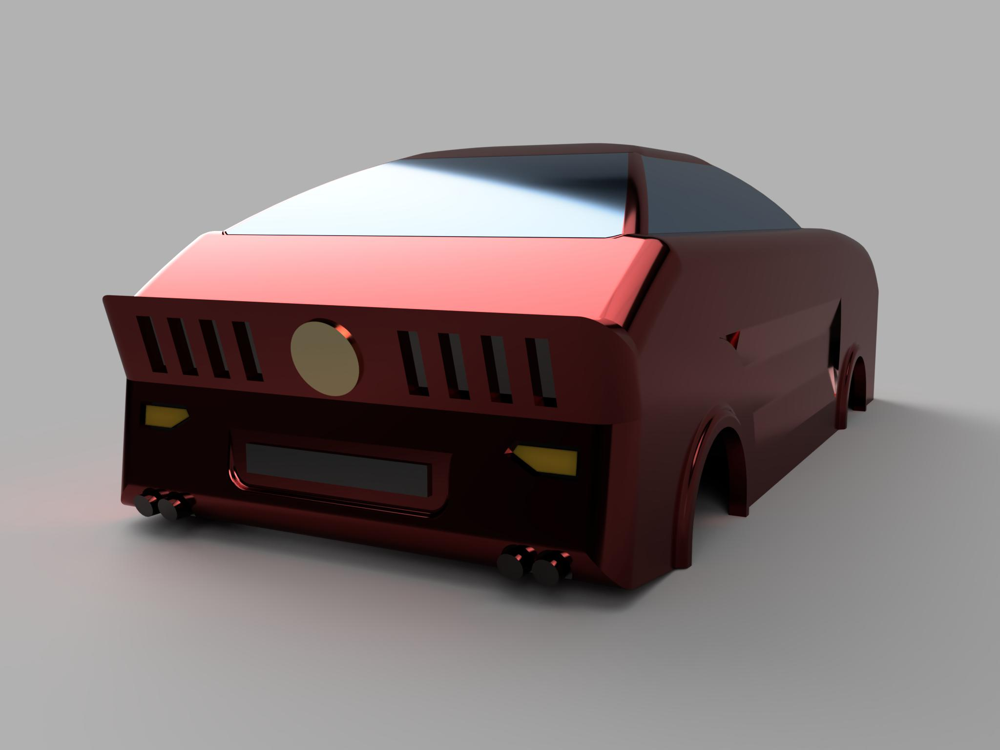
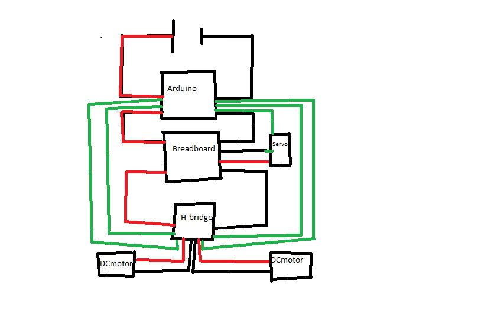

# Arduino car

## The Project
The goal of the project is to create a car model, steered by an Arduino. The arduino is going to control two DC motors in the back of the car connected to the wheels causing it to drive. The ardiuno will also be connected to a servo-motor in order to control the steering. The servo motor will adjust the front axel causing the wheels to turn and lastly causing the car to turn. 

I will give the Arduino functions for the DC motors as well as the servo-motor and combining them to create a program for the car to follow. 
   The original plan was to call on these functions using bluetooth, making it possible to steer the car from your device. Unfortunatly the bluetooth side of the project was too advanced and the time was too little. 
   
   Another way of controlling the car is by using a cable, either to a computer or controlling device. I choose to not use a cable since it restricts the car and limits it to a smaller area, which i feel defeats the purpose of the car.  

I will build a frame using legos. I will then 3D-print the body that I will create in CAD for a more aesthetic look. See the picture down below. 

## The Code 
The code start with including libraries, like servo.h and arduino.h. Libraries are packages that bring extra methods and functionality to the project, in this case are the labraries allowing me by using simple methods from the library to controle the arduino. I declare integers for the pins that will be used in the project. In case I want to change pins i only have to change the integer instead of all the places taking the pin as a variable. I then set up all the pins as outputs, and attached one of the pins to the servo. I then created functions for all the different actions the car could make. Forward, backward, right, left, etc. I then combined all of these functions in the main loop creating an order of actions the car would follow. 

The code is in it's current state pretty simple because the car can't read or react to anything. One way to develop the program further is making a gui where the user can select an order of actions to preset for the car.  

**Components i will use:**
 * Arduino
 * DC-motors x2
 * Servo-motor
 * H-bridge
 * Breadboard
 * Wires

## My work process
The first step was to learn how to use motors. I experimented with DC motors and how to make them turn. After a while a started trying whith a H-bridge, which is a component that can switch the currents direction, this lead to the motors going both forward and backwards with easy commands. 

After experimimenting with DC motors I started trying servo motors. This was the point where I ran into some major problems, my computer couldnt download the servo library. Finally I choose to use Arduino instead of visualstudio code which fixed the problem. 

When I understood how all the components worked I started planning how the car would come together. I made some sketches on how it would look, and how the servo motion would make the car steer. Unfotunatly I have lost these sketches. My main concern was to build a frame where all the componets would fit and also making it compatible with a realistic body. 

When I roughly knew how the car would look i started building it, I had to build it using limited resourses of lego that I had at home. After the frame was done I could put in the components that would steer and drive the car. 

The last step was testing and calibrating the servo to turn the right amount. 

## Pros and Cons with the project. 
The biggest flaw with the project is the controlling of the car. The only way to control the car is to load it with preset instructions via the computer, which means that you can't control it while it's driving. The simplicity of the controle system also leads to pretty simple code. The car does not have to read and react to anything since it has preset instructions to follow causing the code to be simple. 

The main focus is instead on the machanical aspect of the project. Creating a chassi that will fit with the body and making it effecive for its purpose. One of the greatest mechanical challanges was to transform the circular motion of the servo to a straight side to side motion, in order to control the front axle and to steer the car. 

The steering mechanism is actually one of the best attributes of the car, where several components is used and sucessfully transforms the circular motion and makes the wheels turn. 

### Here's a picture of the chassi and the electric circuit. 

### Here's a picture of the body that I designed in CAD
 

### Here's a picture of the schematic of the electric circuit. 

