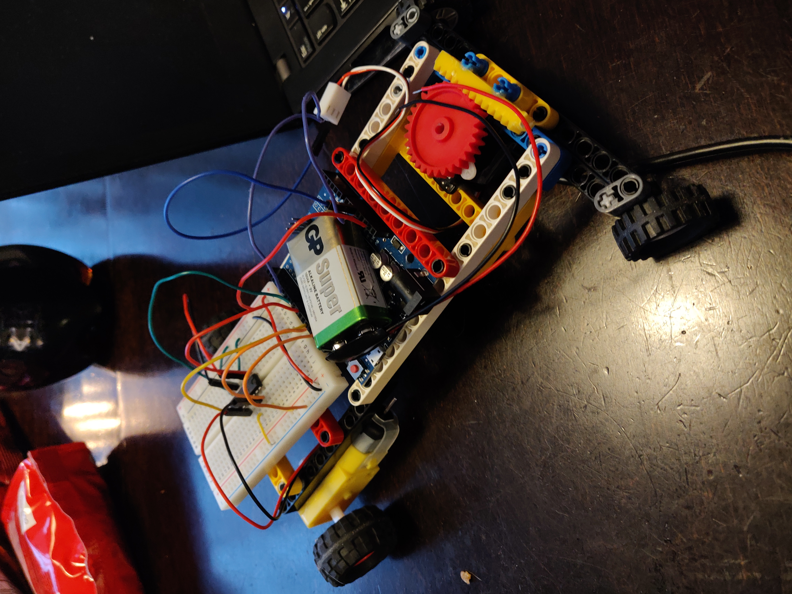

# Arduino car

The goal of the project is to create a car model, steered by an Arduino. The arduino is going to control two DC motors in the back of the car connected to the wheels causing it to drive. The ardiuno will also be connected to a servo-motor in order to control the steering. The servo motor will adjust the front axel causing the wheels to turn and lastly causing the car to turn. 

I will give the Arduino functions for the DC motors as well as the servo-motor and combining them to create a program for the car to follow. 
   The original plan was to call on these functions using bluetooth, making it possible to steer the car from your device. Unfortunatly the bluetooth side of the project was too advanced and the time was too little. 

I will build a frame using legos. I will then 3D-print the body for a more aesthetic look. 

**Components i will use:**
 * Arduino
 * DC-motors x2
 * Servo-motor
 * H-bridge
 * Breadboard
 * Wires

## Pros and Cons with the project. 
The biggest flaw with the project is the controlling of the car. The only way to control the car is to load it with preset instructions via the computer, which means that you can't control it while it's driving. The simplicity of the controle system also leads to pretty simple code. The car does not have to read and react to anything since it has preset instructions to follow causing the code to be simple. 

The main focus is instead on the machanical aspect of the project. Creating a chassi that will fit with the body and making it effecive for its purpose. One of the greatest mechanical challanges was to transform the circular motion of the servo to a straight side to side motion, in order to control the front axle and to steer the car. 

The steering mechanism is actually one of the best attributes of the car, where several components is used and sucessfully transforms the circular motion and makes the wheels turn. 

Here's a picture of the chassi and the electric circuit. 
{:height="50%" width="50%"}
